# HungryGo Frontend Technical Documentation

## Tech Stack
- **Framework:** Next.js (React)
- **Authentication:** Clerk
- **State Management:** Redux
- **Styling:** Modern CSS-in-JS or CSS Modules (recommendation: Tailwind CSS or styled-components)
- **Type Checking:** TypeScript
- **Animation:** GSAP (GreenSock Animation Platform)

## Design Philosophy
Clean, intuitive, and engaging. Focus on ease of use, visual hierarchy, and a friendly, approachable aesthetic. Animations and transitions are purposeful, enhancing the user experience without being distracting. Interactions should feel natural, responsive, and delightful.

## Suggested Color Palette
- **Primary:** Warm mustard yellow (#FFD700) or fresh teal (#00A388) for accents and calls to action
- **Secondary:** Light grey-blue (#E0E7EB) or pale coral (#FFB3A7)
- **Neutrals:** White (#FFFFFF) for backgrounds, charcoal grey (#333333) for text
- **Emphasis:** Forest green (#306B34) for success states or highlights

## Customer Pages

### 🏠 Home Page
- Modern, inviting, mobile-first layout
- Hero section: full-width banner with GSAP-powered parallax scrolling, animated food imagery with staggered reveals, headline with text animation, and CTA button with hover effects
- Value proposition icons: horizontal scroll with smooth inertia scrolling, minimal icons with entrance animations, benefits with sequential text reveals
- Social proof carousel: user avatars with subtle rotation animations, testimonials with fade transitions, auto-scrolling with pause on hover
- How it works: 3-step visual flow with custom illustrations that animate on scroll into view
- Bottom navigation: persistent, intuitive icons with micro-interactions on tap/click
- Color: White background, mustard/teal accents with subtle gradient animations, charcoal text with smooth color transitions on state changes

### 🧑‍💼 Signup/Login Page
- Minimalist, secure, central form with subtle entrance animation
- Clerk-powered social auth (Google, Phone/OTP) with smooth transition effects
- Large, full-width action buttons with tactile feedback animations
- Inline error handling with attention-drawing animations
- Form field focus states with subtle highlighting animations
- Success state celebrations with confetti or checkmark animations
- Uncluttered, direct, reassuring with thoughtful micro-interactions

### 🍛 Meal Plans Page
- Stacked plan cards with elevation and subtle hover animations
- Cards animate into view with staggered timing when page loads
- Headline with emphasis animations, price with count-up animation, benefits with sequential reveals
- Meal type toggle with smooth state transition animations
- CTA buttons with hover and click animations for tactile feedback
- Visual differentiation via animated gradients/shades that subtly shift
- 'Most Popular' tag with attention-grabbing pulse animation
- Scroll-triggered animations as user moves down the page

### 🗓️ Meal Schedule Page
- Horizontal calendar strip with smooth scrolling and date selection animations
- Daily meal cards for Lunch/Dinner with flip or slide animations when toggling between meals
- Dish list with staggered entrance animations, dietary tags with hover information tooltips
- Skip meal toggle with satisfying switch animation and visual confirmation
- Visual feedback for past/upcoming meals with timeline-style animations
- Drag-and-drop meal rescheduling with GSAP-powered smooth animations
- Calendar navigation with animated transitions between weeks/months

### 📦 My Orders Page
- Vertical list of order cards with entrance animations and hover effects
- Date/time with subtle highlighting, meal summary with expandable animation details
- Delivery status badge with state-change animations (e.g., pending to delivered)
- Action buttons (rate/report) with hover and click animations
- Filtering/sorting controls with smooth transition animations when results update
- Pull-to-refresh animation for mobile users
- Empty state animations that guide users to place their first order

### ⚙️ Account Settings Page
- Profile summary with subtle entrance animation, editable fields with focus animations
- Avatar upload/change with preview animations
- List items for settings categories with accordion-style expand/collapse animations
- Toggle switches with smooth state transition animations
- Form save buttons with loading and success state animations
- Prominent logout button with attention-appropriate hover animation
- Confirmation dialogs with entrance/exit animations

### 🧾 Subscription Management Page
- Current plan overview card with highlight animations on important information
- Status badge with state-change animations, renewal date with countdown animation
- Price with subtle emphasis animations when changes occur
- Action buttons (pause, resume, change, cancel) with appropriate feedback animations
- Confirmation flows with thoughtful transition animations
- Plan comparison slider with smooth transition animations
- Billing history with expandable rows and entrance animations
- Payment method management with card flip animations

### 💬 Feedback Page
- Star rating with interactive hover and selection animations
- Text area with subtle focus animations and character count animation
- Quick feedback tags with selection animations and categorized grouping
- Submission button with loading state animation
- Post-submission celebration animation and thank you message
- Feedback history with timeline animations
- Photo upload option with preview animations and editing capabilities

## Admin Pages

### Admin UI/UX Principles
- Data clarity with animated data visualizations that update in real-time
- Efficient workflows with smooth transitions between tasks and steps
- Consistent navigation with subtle animation cues for current location
- Professional color palette: dark blues/greys with subtle gradient animations, teal/mustard accents with state-change animations
- Micro-interactions that provide system feedback and improve task completion
- Animation patterns that highlight important information without distraction
- Consistent motion design language across all admin interfaces

### 📊 Dashboard Page
- Sidebar navigation with subtle hover and selection animations
- KPI cards with entrance animations and number count-up effects
- Interactive charts (line, donut, bar) with GSAP-powered data visualization animations
- Charts animate on load and when data updates with smooth transitions
- Recent activity stream with new item highlight animations
- Quick actions with hover and click feedback animations
- Global search with results animation and highlighting effects
- Responsive layout transitions when resizing or changing device orientation

### 👥 Manage Users Page
- Search, filter, add user
- Responsive data table, color-coded badges
- Details sidebar/modal for user info and actions

### 🍽️ Manage Meals Page
- Week picker, menu grid (calendar style)
- Edit/copy meal actions
- Add/edit meal modal with tag-input, preview, drag-and-drop

### 💰 Subscription Plans Page
- Card/table layout for plans
- Edit, delete, add new plan modal

### 💸 Payments Page
- Search, filter, export
- Transaction table, details modal

### 🚚 Delivery Logs Page
- Date/status filters, order table/cards
- Assign/mark delivered actions
- Delivery agent sidebar, map view toggle (optional) 

---

## Recommended Production Folder Structure

A scalable, maintainable Next.js frontend project structure for HungryGo:

```
/frontend
│
├── app/                # Next.js App Router (entry points, layouts, templates)
│   ├── layout.tsx      # Root layout
│   ├── page.tsx        # Main page (if using App Router)
│   └── ...             # Other route segments
│
├── pages/              # (If using Pages Router) Route-based files (index.tsx, api/)
│
├── components/         # Reusable UI components (Button, Card, Navbar, etc.)
│   └── ...
│
├── services/           # API calls, data fetching, business logic (mealService.ts, authService.ts)
│   └── ...
│
├── hooks/              # Custom React hooks (useAuth.ts, useMealPlans.ts)
│   └── ...
│
├── store/              # Redux store setup, slices, middleware
│   └── ...
│
├── styles/             # Global styles, theme, Tailwind config, etc.
│   └── ...
│
├── utils/              # Utility functions, helpers
│   └── ...
│
├── public/             # Static assets (images, icons, fonts)
│   └── ...
│
├── middleware.ts       # Next.js middleware (auth, redirects)
├── next.config.js      # Next.js configuration
├── tsconfig.json       # TypeScript configuration
└── ...
```

### Folder Descriptions
- **app/**: Main entry for App Router (Next.js 13+), layouts, templates, and route segments.
- **pages/**: Traditional Pages Router (for legacy or API routes).
- **components/**: All shared and page-specific React components.
- **services/**: API interaction and business logic abstraction.
- **hooks/**: Custom hooks for stateful logic reuse.
- **store/**: Redux store, slices, and middleware.
- **styles/**: CSS, Tailwind, or styled-components theme files.
- **utils/**: Helper functions and utilities.
- **public/**: Static files served at the root.
- **middleware.ts**: Edge middleware for auth, redirects, etc.

> Adjust structure as needed for your team and project scale. For large projects, consider further sub-structuring by feature or domain (feature-based folders). 

## Error Handling
- API errors are caught and displayed to users via toast notifications (e.g., using react-toastify) or inline error messages.
- Global error boundaries are used to catch unexpected errors and show a fallback UI.

## Loading States & Transitions
- Use GSAP-powered loading animations that match the brand aesthetic
- Implement skeleton screens with subtle pulse animations while fetching data
- Show optimistic UI updates with smooth transition animations for better UX
- Page transitions with coordinated enter/exit animations
- Route changes with meaningful transition effects that maintain context
- List item entrance animations with staggered timing for natural feel
- Content block reveal animations that guide user attention
- Loading state animations that communicate progress clearly

## Accessibility
- Follow WCAG guidelines for color contrast, keyboard navigation, and ARIA attributes.
- Use tools like eslint-plugin-jsx-a11y and browser extensions (axe, Lighthouse) to audit accessibility.

## Testing
- Unit tests: Jest for logic and utility functions.
- Component tests: React Testing Library for UI components.
- End-to-end (e2e): Cypress for user flows and integration.
- Test files are colocated with components or in a `/tests` directory.

## CI/CD & Linting
- Automated deployments via GitHub Actions or Vercel.
- Pull requests trigger preview deployments.
- Linting and formatting enforced with ESLint and Prettier.

## API Client & Auth
- All API calls use a shared Axios instance (or fetch wrapper) in `/services`.
- Auth tokens (from Clerk) are attached to requests via interceptors or headers.
- Centralized error handling and retry logic in the API client.

## Getting Started
1. Clone the repo and install dependencies: `npm install`
2. Copy `.env.example` to `.env` and fill in required values (e.g., API base URL, Clerk keys).
3. Start the dev server: `npm run dev`
4. Run tests: `npm test`

## Diagrams

### Frontend Page Flow Diagram

```mermaid
graph TD
  Home[🏠 Home]
  Signup[🧑‍💼 Signup/Login]
  MealPlans[🍛 Meal Plans]
  MealSchedule[🗓️ Meal Schedule]
  Orders[📦 My Orders]
  Account[⚙️ Account Settings]
  Subscription[🧾 Subscription Management]
  Feedback[💬 Feedback]
  AdminDash[📊 Admin Dashboard]
  AdminUsers[👥 Manage Users]
  AdminMeals[🍽️ Manage Meals]
  AdminPlans[💰 Subscription Plans]
  AdminPayments[💸 Payments]
  AdminDelivery[🚚 Delivery Logs]
  AdminFeedback[💬 Feedback Moderation]

  Home --> Signup
  Home --> MealPlans
  MealPlans --> MealSchedule
  MealSchedule --> Orders
  Orders --> Feedback
  Home --> Account
  Account --> Subscription
  Home --> Feedback
  Signup --> Home
  AdminDash --> AdminUsers
  AdminDash --> AdminMeals
  AdminDash --> AdminPlans
  AdminDash --> AdminPayments
  AdminDash --> AdminDelivery
  AdminDash --> AdminFeedback
```


### Frontend Data Flow Diagram
```mermaid
graph LR
  User[User Action]
  Page[Page/Component]
  Service[Service (API Client)]
  API[Backend API]
  Store[Redux Store]
  UI[UI Feedback (Toasts, Loaders)]

  User --> Page
  Page --> Service
  Service --> API
  API --> Service
  Service --> Store
  Store --> Page
  Service --> UI
  Page --> UI
```

## API Integration

Below is a mapping of frontend pages/components to backend API endpoints:

### Home Page
- No direct API calls (static content, testimonials may be fetched from `/api/feedback`)

### Signup/Login Page
- `POST /api/auth/signup` — User registration
- `POST /api/auth/login` — User login
- `POST /api/auth/logout` — User logout

### Meal Plans Page
- `GET /api/meal-plans` — Fetch available meal plans
- `GET /api/meals` — Fetch meals for display

### Meal Schedule Page
- `GET /api/schedule` — Fetch user meal schedule
- `PUT /api/schedule/:id` — Update/skip meal in schedule

### My Orders Page
- `GET /api/orders` — List user orders
- `GET /api/orders/:id` — Order details
- `PUT /api/orders/:id` — Update/cancel order

### Account Settings Page
- `GET /api/auth/me` — Fetch user profile
- `PUT /api/users/:id` — Update user profile

### Subscription Management Page
- `GET /api/subscriptions` — List subscriptions
- `POST /api/subscriptions` — Create subscription
- `PUT /api/subscriptions/:id` — Update subscription
- `POST /api/subscriptions/:id/pause` — Pause subscription
- `POST /api/subscriptions/:id/resume` — Resume subscription
- `POST /api/subscriptions/:id/cancel` — Cancel subscription

### Feedback Page
- `POST /api/feedback` — Submit feedback

---

## Admin Pages

### Dashboard Page
- `GET /api/orders` — Recent orders
- `GET /api/users` — User stats
- `GET /api/feedback` — Recent feedback

### Manage Users Page
- `GET /api/users` — List users
- `PUT /api/users/:id` — Update user
- `DELETE /api/users/:id` — Delete user

### Manage Meals Page
- `GET /api/meals` — List meals
- `POST /api/meals` — Add meal
- `PUT /api/meals/:id` — Edit meal
- `DELETE /api/meals/:id` — Delete meal

### Subscription Plans Page
- `GET /api/meal-plans` — List plans
- `POST /api/meal-plans` — Add plan
- `PUT /api/meal-plans/:id` — Edit plan
- `DELETE /api/meal-plans/:id` — Delete plan

### Payments Page
- `GET /api/payments/history` — List transactions

### Delivery Logs Page
- `GET /api/delivery/logs` — Delivery logs
- `POST /api/delivery/assign` — Assign order
- `PUT /api/delivery/:orderId/status` — Update delivery status

### Feedback Moderation
- `GET /api/feedback` — List feedback
- `PUT /api/feedback/:id` — Update feedback
- `DELETE /api/feedback/:id` — Delete feedback

--- 

---

## Frontend Development Phases Plan

### Phase 1: Core Customer Experience
- **Goal:** Deliver the essential user-facing features for meal plan selection, ordering, and account management.
- **Key Deliverables:**
  - Home Page (static content, testimonials)
  - Signup/Login (Clerk integration, social auth)
  - Meal Plans Page (fetch/display plans)
  - Meal Schedule Page (calendar, meal cards)
  - My Orders Page (order list, status)
  - Account Settings Page (profile, logout)
  - Subscription Management (view, basic actions)
  - Feedback Page (submit feedback)
  - API integration for above
  - Responsive/mobile-first UI
  - Basic error/loading states

### Phase 2: Admin Portal & Advanced Features
- **Goal:** Enable admin workflows and enhance user experience with advanced features.
- **Key Deliverables:**
  - Admin Dashboard (KPIs, charts, activity)
  - Manage Users (table, search, edit/delete)
  - Manage Meals (calendar grid, add/edit)
  - Subscription Plans Management (CRUD)
  - Payments Page (transactions, export)
  - Delivery Logs (order assignment, status)
  - Feedback Moderation (list, update/delete)
  - Role-based access (admin vs. user)
  - Improved error boundaries and notifications

### Phase 3: Polish, Testing & Optimization
- **Goal:** Refine, test, and optimize for production readiness.
- **Key Deliverables:**
  - Comprehensive unit/component/e2e tests
  - Accessibility audit and improvements (including animation pause/reduce options)
  - Performance optimization (code splitting, lazy loading, animation throttling)
  - UI/UX polish with GSAP animations and thoughtful micro-interactions
  - Animation timing and easing standardization across the application
  - Motion design system implementation with reusable animation components
  - CI/CD setup (linting, preview deploys)
  - Documentation and onboarding guides with animated tutorials

> Adjust phases as needed based on team velocity and business priorities.